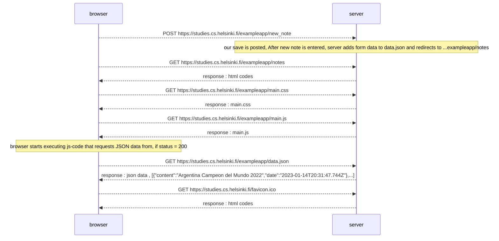

```mermaid
sequenceDiagram
    participant browser
    participant server

    browser-->>server: POST https://studies.cs.helsinki.fi/exampleapp/new_note
    Note over server: our save is posted, After new note is entered, server adds form data to data.json and redirects to ...exampleapp/notes

    browser-->>server: GET https://studies.cs.helsinki.fi/exampleapp/notes
    server-->>browser: response : html codes

    browser-->>server: GET https://studies.cs.helsinki.fi/exampleapp/main.css
    server-->>browser: response : main.css

    browser-->>server: GET https://studies.cs.helsinki.fi/exampleapp/main.js
    server-->>browser: response : main.js

    Note over browser: browser starts executing js-code that requests JSON data from, if status = 200

    browser-->>server: GET https://studies.cs.helsinki.fi/exampleapp/data.json
    server-->>browser: response : json data , [{"content":"Argentina Campeon del Mundo 2022","date":"2023-01-14T20:31:47.744Z"},...]

    browser-->>server: GET https://studies.cs.helsinki.fi/favicon.ico
    server-->>browser: response : html codes

   
 
```