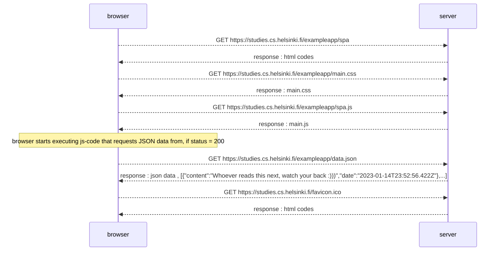

```mermaid
sequenceDiagram
    participant browser
    participant server   

    browser-->>server: GET https://studies.cs.helsinki.fi/exampleapp/spa
    server-->>browser: response : html codes

    browser-->>server: GET https://studies.cs.helsinki.fi/exampleapp/main.css
    server-->>browser: response : main.css

    browser-->>server: GET https://studies.cs.helsinki.fi/exampleapp/spa.js
    server-->>browser: response : main.js

    Note over browser: browser starts executing js-code that requests JSON data from, if status = 200

    browser-->>server: GET https://studies.cs.helsinki.fi/exampleapp/data.json
    server-->>browser: response : json data , [{"content":"Whoever reads this next, watch your back :)))","date":"2023-01-14T23:52:56.422Z"},...]

    browser-->>server: GET https://studies.cs.helsinki.fi/favicon.ico
    server-->>browser: response : html codes
 
```